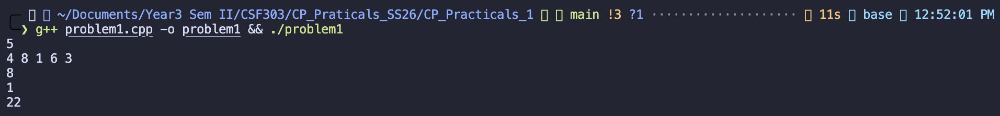
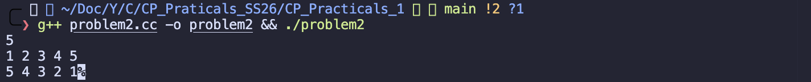
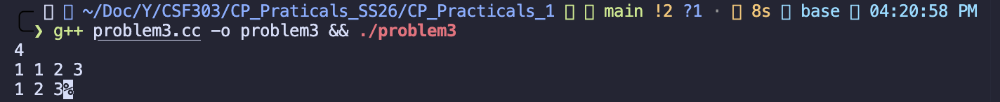
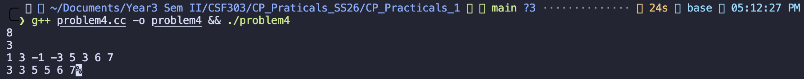
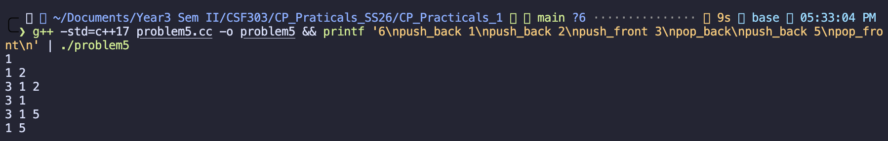
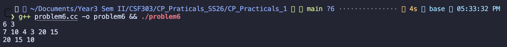
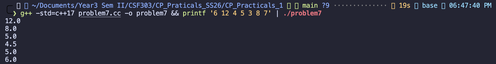
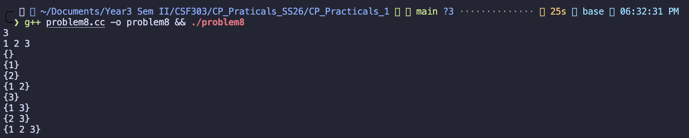
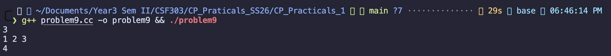
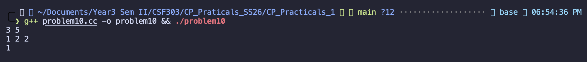

# CP Practicals Analysis

## Problem 1 — Array Statistics (Maximum, Minimum, and Sum)

### Problem Summary

This program accepts N integers from user input and computes 3 basic statistics: the **maximum number**, the **minimum number**, and the **summation** of all the numbers. These tasks represent basic operations on an array of information and demonstrate the use of fundamental vector functions in C++.

### Algorithm Explanation

1. **Input Reading:** The program first reads n (the number of elements).
2. **Array Population & Sum Calculation:** It iterates through n iterations, reading each integer into the vector arr and simultaneously accumulating the sum using a long long variable to avoid overflow.
3. **Finding Maximum:** Uses the STL max_element() function to find the largest element and dereferences the iterator to print its value.
4. **Finding Minimum:** Uses the STL min_element() function to find the smallest element and dereferences the iterator to print its value.
5. **Output:** The three values are printed on separate lines: maximum, minimum, and sum.

### Time Complexity

**O(N)** A single traversal of the array is required to access each number in it to determine the cumulative sum of all the reference values or maximum and minimum values in the array `(both max_element() / min_element() perform at O(N)`.

### Space Complexity

**O(N)** for storing the input array in the vector. The additional variables (`sum`, iterators) require only constant space.

### Key Observations

- **Use of `long long` for Sum**: Using `long long` instead of `int` prevents overflow when dealing with large values or large array sizes.
- **STL Algorithms**: The code leverages C++ Standard Library functions (`max_element`, `min_element`) which are optimized and reliable.
- **Iterator Dereferencing**: The `*` operator dereferences the iterator returned by `max_element()` and `min_element()` to access the actual value.

### Reflection

This problem demonstrates the importance of using appropriate data types and built-in algorithms. Rather than implementing manual max/min search logic, using STL functions ensures correctness and readability. The single-pass approach for sum calculation is efficient and minimizes memory access overhead.

---

## Problem 2 — Reverse the Array

### Problem Summary

Here, I was given N integers and needed to print them in reverse order. The main idea was to store the values first and then traverse them backwards.

### Algorithm Explanation

I stored all the numbers in a vector. After that, I used a loop starting from the last index and moved back to the first index. During this reverse traversal, I printed each element in order.

### Time Complexity

**O(N)** because reading the array takes one pass and printing it in reverse takes another pass.

### Space Complexity

**O(N)** because the numbers are stored in a vector.

### Reflection

This problem was straightforward, but it was a good reminder that reversing does not always require a special function. Sometimes just changing the direction of traversal is enough.

---

## Problem 3 — Remove Duplicates

### Problem Summary

In this problem, I had to remove repeated elements from a list of integers and print only the unique values. The output also needed to be in sorted order.

### Algorithm Explanation

First, I stored all the numbers in a vector. Then I sorted the vector so that any duplicate values would come next to each other. After sorting, I used `unique()` to shift the duplicates to the end and then removed them using `erase()`. Finally, I printed the remaining values.

### Time Complexity

**O(N log N)** because sorting takes the most time, while removing duplicates afterward is linear.

### Space Complexity

**O(N)** because the vector stores all input elements.

### Reflection

This problem helped me understand why sorting is useful before removing duplicates. I also learned more clearly how `unique()` works in C++, since it only works properly when duplicate values are adjacent.

---

## Problem 4 — Sliding Window Maximum

### Problem Summary

In this question, I needed to find the maximum element in every window of size K as the window moves across the array. A brute-force solution would be slow, so an efficient method was needed.

### Algorithm Explanation

I used a deque to store indices of useful elements. While moving through the array, I removed indices that were outside the current window. Then I removed smaller elements from the back of the deque because they could never become the maximum while a larger element was present. The front of the deque always stored the index of the maximum element for the current window.

### Time Complexity

**O(N)** because each element is inserted and removed from the deque at most once.

### Space Complexity

**O(K)** because the deque stores indices from the current window only.

### Reflection

This was one of the most interesting problems for me. At first I thought of checking each window separately, but that would take too much time. Using a deque showed me how the right data structure can reduce the complexity from $O(NK)$ to $O(N)$.

---

## Problem 5 — Balanced Line Problem

### Problem Summary

This problem simulated a line where people could enter or leave from both the front and the back. After every operation, I had to print the current state of the line.

### Algorithm Explanation

I used a deque because it supports insertion and deletion from both ends efficiently. For `push_front` and `push_back`, I added the given value to the appropriate side. For `pop_front` and `pop_back`, I removed an element only if the deque was not empty. After each operation, I printed all current elements in order.

### Time Complexity

**O(Q × N)** in the worst case, because each operation on the deque is fast, but printing the whole line after every step may take up to O(N).

### Space Complexity

**O(N)** because the deque stores the people currently in the line.

### Reflection

This problem made the purpose of a deque very clear. A vector would not be efficient for front operations, but a deque handles both ends naturally, so it was the right choice here.

---

## Problem 6 — K Largest Elements

### Problem Summary

In this problem, I had to find and print the K largest numbers from a list of N integers. The output had to be in descending order.

### Algorithm Explanation

I used a `priority_queue`, which works as a max heap in C++. I inserted all the numbers into the heap. Then I removed the top element K times. Since the top of a max heap is always the largest value, this directly gave me the K largest numbers in order.

### Time Complexity

**O(N log N + K log N)** because inserting N elements into the heap takes O(N log N), and removing the top K times takes O(K log N).

### Space Complexity

**O(N)** because the heap stores all input elements.

### Reflection

This problem helped me understand how useful heaps are for ranking-based questions. Instead of sorting the whole array manually in my logic, I could let the priority queue maintain the order for me.

---

## Problem 7 — Running Median

### Problem Summary

This problem required printing the median after each new number was added to the sequence. Since the data was arriving one by one, I needed a method that worked efficiently for a stream of values.

### Algorithm Explanation

I used two heaps. One max heap stored the smaller half of the numbers, and one min heap stored the larger half. After inserting a new value into the correct heap, I rebalanced them so that their sizes stayed nearly equal. If both heaps had the same size, the median was the average of the two top values. Otherwise, the median was the top of the larger heap.

### Time Complexity

**O(N log N)** because each insertion and balancing step takes O(log N), and this happens for every input value.

### Space Complexity

**O(N)** because all inserted elements are stored across the two heaps.

### Reflection

This problem felt more advanced than the earlier ones, but it taught me an important pattern. Using two heaps is much better than sorting the data again after every insertion, and it showed me how online problems can still be solved efficiently.

---

## Problem 8 — Subset Generation

### Problem Summary

In this question, I had to generate all possible subsets of a given set of numbers. Since a set with N elements has $2^N$ subsets, the goal was to print every valid combination.

### Algorithm Explanation

I used the bitmask technique. I looped from 0 to $2^N - 1$, and each number in that range represented one subset. For every bit position, if the bit was set, I included that element in the subset. If it was not set, I skipped it. This gave all subsets in a systematic way.

### Time Complexity

**O(2^N × N)** because there are $2^N$ subsets, and for each one I check all N positions.

### Space Complexity

**O(1)** extra space, ignoring the output.

### Reflection

This problem helped me see how binary numbers can represent subsets. Once I understood that each bit stands for “take” or “do not take,” the method became very natural.

---

## Problem 9 — Count Subsets with Even Sum

### Problem Summary

This problem asked me to count how many subsets of the given numbers have an even total sum. The idea was similar to subset generation, but instead of printing subsets, I had to count valid ones.

### Algorithm Explanation

I again used bitmasking to generate every possible subset. For each subset, I added the values of the selected elements. After calculating the sum, I checked whether it was even. If it was, I increased the count. At the end, I printed the final count.

### Time Complexity

**O(2^N × N)** because I generate all subsets and compute the sum of elements in each one.

### Space Complexity

**O(1)** extra space, excluding input storage.

### Reflection

This problem reinforced the bitmask idea from the previous question. It also showed me that the same generation technique can be reused for different goals, such as printing, counting, or checking conditions.

---

## Problem 10 — Count Subsets with Sum Equal to Target

### Problem Summary

In this problem, I had to count how many subsets add up to a given target value. Since checking all subsets directly can be slow for larger inputs, I used dynamic programming.

### Algorithm Explanation

I defined `dp[i][j]` as the number of ways to make sum `j` using the first `i` elements. For each element, there were two choices: either include it or exclude it. So the value of each state came from previous results. If the current element was not greater than the target sum I was building, I added both possibilities together.

### Time Complexity

**O(N × target)** because I fill a table with `N + 1` rows and `target + 1` columns.

### Space Complexity

**O(N × target)** because the DP table stores results for all states.

### Reflection

This problem helped me understand subset-sum dynamic programming more clearly. Compared to checking every subset one by one, DP felt much more structured and efficient, especially when the target value is manageable.

---

## General Reflection on the Series

These practicals helped me build confidence with both basic and intermediate problem-solving techniques in C++. The earlier problems strengthened my understanding of arrays, vectors, and simple traversals, while the later ones introduced more efficient data structures like deque, heap, and dynamic programming tables.

Overall, I learned that choosing the right approach matters a lot. In some problems, a direct loop is enough, but in others, using a deque, priority queue, bitmask, or DP makes the solution much more efficient and easier to manage.
