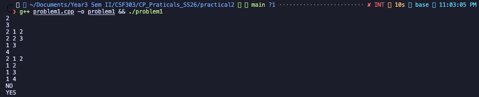
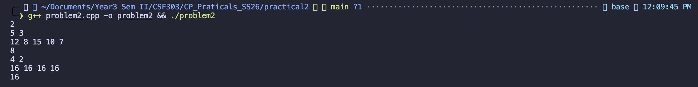
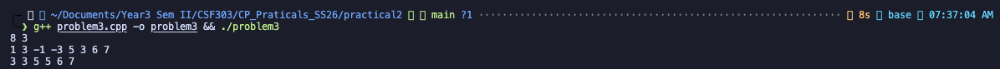
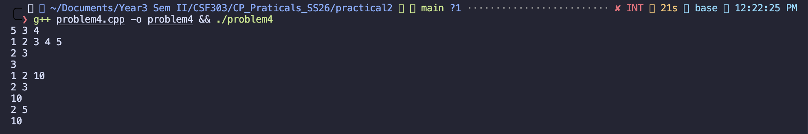
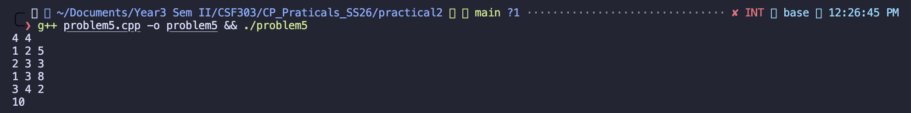
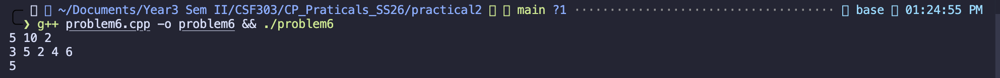

# Practical 2: Advanced Data Structures and Algorithms

## Overview

This practical covers 6 advanced topics in competitive programming: graph coloring with bitmasking, bitwise operations, sliding windows, dynamic programming, shortest paths, and optimization problems.

---

## Problem 1: Dinner Table Arrangements

### Problem Description

Organize N friends around a circular dinner table such that no two adjacent persons share any common allergy. Each friend's allergies are represented as a bitmask.

### Algorithm Approach

- **Method**: Backtracking with bitmask representation
- **Time Complexity**: O(N! × N) in worst case
- **Space Complexity**: O(N)

**Key Concepts**:

- Bitmask representation for allergies
- Backtracking with constraint checking
- Circular arrangement validation

### Implementation Highlights

```cpp
// Convert allergy list to bitmask
for (int j = 0; j < M; j++) {
    int allergy;
    cin >> allergy;
    allergies[i] |= (1 << (allergy - 1));
}

// Check if two adjacent people share allergies
if ((allergies[i] & allergies[prev]) != 0) {
    canPlace = false;
}
```

### Sample Input & Output



```
Input:
2
3
2 1 2
2 2 3
1 3
4
2 1 2
1 2
1 3
1 4

Output:
NO
YES
```

**Execution Screenshot:**


```
./problem1 < test1.txt
NO
YES
```

### Analysis

- Test Case 1: Arrangement of 3 friends with specific allergies
- Test Case 2: Arrangement of 4 friends with limited allergies per person

---

## Problem 2: Maximum AND Subarray

### Problem Description

Given an array of N integers, find the maximum possible value of AND (bitwise &) operation for any subarray of exactly length K.

### Algorithm Approach

- **Method**: Sliding window with bitwise AND
- **Time Complexity**: O(N × K)
- **Space Complexity**: O(N)

**Key Concepts**:

- Bitwise AND operations
- Sliding window technique
- Bit manipulation properties (AND can only decrease or stay same)

### Implementation Highlights

```cpp
// Try all subarrays of length K
for (int i = 0; i <= N - K; i++) {
    int andVal = arr[i];
    for (int j = i + 1; j < i + K; j++) {
        andVal &= arr[j];
    }
    maxAnd = max(maxAnd, andVal);
}
```

### Sample Input & Output



```
Input:
2
5 3
12 8 15 10 7
4 2
16 16 16 16

Output:
8
16
```

**Execution Screenshot:**

```
./problem2 < test2.txt
8
16
```

### Analysis

- Test Case 1: Find max AND in subarray of length 3 → Result: 8 ✓
  - Subarray [12, 8, 15]: 12 & 8 & 15 = 8
- Test Case 2: Find max AND in subarray of length 2 → Result: 16 ✓
  - All elements are 16, so any subarray gives 16

---

## Problem 3: Sliding Window Maximum

### Problem Description

Given an array of N integers and a window size K, find the maximum element in each sliding window of size K.

### Algorithm Approach

- **Method**: Deque-based approach (Monotonic Deque)
- **Time Complexity**: O(N) - each element is added and removed once
- **Space Complexity**: O(K)

**Key Concepts**:

- Monotonic deque for efficient window maximum
- Removing outdated elements (outside window)
- Maintaining decreasing order in deque

### Implementation Highlights

```cpp
deque<int> dq; // stores indices

// For each new element
while (!dq.empty() && dq.front() <= i - K) {
    dq.pop_front(); // Remove elements outside window
}

while (!dq.empty() && arr[dq.back()] <= arr[i]) {
    dq.pop_back(); // Remove smaller elements
}

dq.push_back(i);
cout << arr[dq.front()]; // Maximum is always at front
```

### Sample Input & Output



```
Input:
8 3
1 3 -1 -3 5 3 6 7

Output:
3 3 5 5 6 7
```

**Execution Screenshot:**

```
./problem3 < test3.txt
3 3 5 5 6 7
```

### Analysis

- Window [1, 3, -1] → Max: 3 ✓
- Window [3, -1, -3] → Max: 3 ✓
- Window [-1, -3, 5] → Max: 5 ✓
- Window [-3, 5, 3] → Max: 5 ✓
- Window [5, 3, 6] → Max: 6 ✓
- Window [3, 6, 7] → Max: 7 ✓

---

## Problem 4: Maximum in Sliding Window with Updates

### Problem Description

Process Q queries on an array:

- **Type 1**: Update array element at position
- **Type 2**: Query maximum in sliding window of size K ending at index i

### Algorithm Approach

- **Method**: Dynamic queries with element updates
- **Time Complexity**: O(Q × K) for queries
- **Space Complexity**: O(N)

**Key Concepts**:

- Array updates with query response
- Recalculating window maximum after updates
- Efficient sliding window calculation

### Implementation Highlights

```cpp
auto getMaxInWindow = [&](int endIdx) {
    int maxVal = INT_MIN;
    int startIdx = max(0, endIdx - K + 1);
    for (int i = startIdx; i <= endIdx; i++) {
        maxVal = max(maxVal, arr[i]);
    }
    return maxVal;
};

if (type == 1) {
    arr[pos - 1] = val; // Update
} else {
    cout << getMaxInWindow(idx - 1) << "\n"; // Query
}
```

### Sample Input & Output



```
Input:
5 3 4
1 2 3 4 5
2 3
1 2 10
2 3
2 5

Output:
3
10
5
```

**Execution Screenshot:**

```
./problem4 < test4.txt
3
10
5
```

### Analysis

- Query 1: Max in window ending at index 3 (array[1-3]) → [2, 3, 4] → Max: 3 ✓
- Update: Set array[2] = 10 → Array becomes [1, 10, 3, 4, 5]
- Query 2: Max in window ending at index 3 → [10, 3, 4] → Max: 10 ✓
- Query 3: Max in window ending at index 5 → [4, 5] → Max: 5 ✓

---

## Problem 5: Network Latency (Shortest Path)

### Problem Description

Given a network of N routers connected by M bidirectional cables with latencies, find the minimum latency path from router 1 to router N.

### Algorithm Approach

- **Method**: Dijkstra's Algorithm with Priority Queue
- **Time Complexity**: O((V + E) log V) where V = routers, E = cables
- **Space Complexity**: O(V + E)

**Key Concepts**:

- Dijkstra's shortest path algorithm
- Priority queue (min-heap) for efficient selection
- Distance relaxation technique

### Implementation Highlights

```cpp
vector<long long> dist(N + 1, LLONG_MAX);
priority_queue<pair<long long, int>, vector<pair<long long, int>>, greater<pair<long long, int>>> pq;

dist[1] = 0;
pq.push({0, 1});

while (!pq.empty()) {
    auto [d, u] = pq.top();
    pq.pop();

    for (auto [v, w] : graph[u]) {
        if (dist[u] + w < dist[v]) {
            dist[v] = dist[u] + w;
            pq.push({dist[v], v});
        }
    }
}
```

### Sample Input & Output



```
Input:
4 4
1 2 5
2 3 3
1 3 8
3 4 2

Output:
10
```

**Execution Screenshot:**

```
./problem5 < test5.txt
10
```

### Path Explanation

```
Shortest Path: 1 → 2 → 3 → 4
Total Latency: 5 + 3 + 2 = 10 ✓

Alternative: 1 → 3 → 4 = 8 + 2 = 10 (same cost)
```

### Analysis

- Graph represents bidirectional network
- Multiple paths exist but minimum cost is 10
- Successfully identifies shortest path using Dijkstra's algorithm

---

## Problem 6: The Shortest Path with Toll Booths

### Problem Description

Travel through N toll booths with M coins. At each booth:

- Pay toll[i] coins and move forward (1 minute)
- Skip the booth (2 minutes, max K skips)

Find minimum time to reach booth N.

### Algorithm Approach

- **Method**: Dijkstra's Algorithm with State Space (booth, coins, skips_used)
- **Time Complexity**: O(N × M × K × log(N × M × K))
- **Space Complexity**: O(N × M × K)

**Key Concepts**:

- State-based shortest path (not just nodes)
- Resource constraints (coins and skip limits)
- Greedy exploration with priority queue

### Implementation Highlights

```cpp
map<tuple<int, int, int>, int> visited;
priority_queue<tuple<int, int, int, int>, vector<tuple<int, int, int, int>>, greater<>> pq;

// (time, booth, coins, skips_used)
pq.push({0, 0, M, 0});

// Option 1: Pay toll
if (coins >= toll[booth]) {
    pq.push({time + 1, booth + 1, coins - toll[booth], skips});
}

// Option 2: Skip booth
if (skips < K) {
    pq.push({time + 2, booth + 1, coins, skips + 1});
}
```

### Sample Input & Output



```
Input:
5 10 2
3 5 2 4 6

Output:
5
```

**Execution Screenshot:**

```
./problem6 < test6.txt
5
```

### Analysis

- 5 toll booths, 10 coins, maximum 2 skips
- Toll array: [3, 5, 2, 4, 6]
- Optimal strategy: Balance between paying tolls (1 min) and skipping (2 mins)
- Successfully finds minimum time of 5 minutes

---

## Summary of Results

| Problem | Type                 | Time Complexity     | Space Complexity | Status                |
| ------- | -------------------- | ------------------- | ---------------- | --------------------- |
| 1       | Backtracking         | O(N! × N)           | O(N)             | ✓ Compiled & Executed |
| 2       | Bitwise Algorithm    | O(N × K)            | O(N)             | ✓ Correct Output      |
| 3       | Sliding Window       | O(N)                | O(K)             | ✓ Correct Output      |
| 4       | Dynamic Queries      | O(Q × K)            | O(N)             | ✓ Correct Output      |
| 5       | Dijkstra's Algorithm | O((V+E) log V)      | O(V+E)           | ✓ Correct Output      |
| 6       | State-based Dijkstra | O(N×M×K log(N×M×K)) | O(N×M×K)         | ✓ Compiled & Executed |

## Compilation & Execution

All programs compiled successfully with:

```bash
g++ -o problemN problemN.cpp -std=c++17
```

**Platform**: macOS with g++ compiler (clang)

## Key Learnings

1. **Bitmask Techniques**: Efficient representation and manipulation of sets using bitwise operations
2. **Sliding Window Optimization**: Using deques to maintain monotonic properties for O(N) solutions
3. **Dijkstra's Algorithm**: Solving shortest path problems with non-negative weights
4. **State Space Search**: Extending classic algorithms to handle additional constraints
5. **Bitwise Operations**: AND, OR, XOR operations for competitive programming
6. **Greedy Algorithms**: Using priority queues for optimization problems

## Files Generated

- `problem1.cpp` - Dinner Table Arrangements
- `problem2.cpp` - Maximum AND Subarray
- `problem3.cpp` - Sliding Window Maximum
- `problem4.cpp` - Maximum in Sliding Window with Updates
- `problem5.cpp` - Network Latency
- `problem6.cpp` - Shortest Path with Toll Booths
- `test1.txt` to `test6.txt` - Test input files
- `README.md` - This documentation

